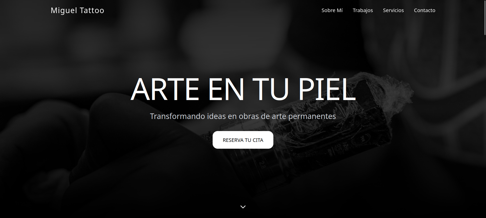

# Miguel Tattoo Project


Landing page moderna para el portafolio y captación de clientes de un estudio de tatuajes.

## Demo

- Producción: https://miguel-tattoo.vercel.app/

## Descripción

Este proyecto es una SPA construida con React + Vite que presenta la marca personal de Miguel Tattoo.
Incluye navegación suave entre secciones, animaciones, galería visual con modal de imagen y un CTA directo a WhatsApp para agendar consultas.

## Características principales

- Hero principal con llamado a la acción.
- Menú responsive (desktop + móvil con hamburguesa animada).
- Secciones informativas: Sobre mí, Trabajos, Servicios y Contacto.
- Galería interactiva con ampliación de imágenes en modal.
- Animaciones de entrada y scroll con Motion.
- Diseño responsive y estilado con Tailwind CSS v4.
- Componente reutilizable para fallback de imágenes.

## Stack tecnológico

- React 18
- Vite 6
- TypeScript (entrypoint y configuración)
- Tailwind CSS v4
- Motion
- Lucide React (íconos)

## Requisitos

- Node.js 18+ (recomendado)
- pnpm (recomendado, el proyecto incluye `pnpm-lock.yaml`)

## Instalación y ejecución local

```bash
pnpm install
pnpm dev
```

La app estará disponible en `http://localhost:5173`.

## Scripts disponibles

- `pnpm dev`: inicia el servidor de desarrollo con Vite.
- `pnpm build`: genera la build de producción.

## Estructura del proyecto

```text
.
├── index.html
├── package.json
├── vite.config.ts
└── src
	├── main.tsx
	├── app
	│   ├── App.tsx
	│   └── components
	│       ├── ImageWithFallback.tsx
	│       ├── figma
	│       └── ui
	└── styles
		├── index.css
		├── tailwind.css
		├── theme.css
		└── fonts.css
```

## Flujo de despliegue

Este repositorio está desplegado en Vercel:

- URL: https://miguel-tattoo.vercel.app/
- Build command: `pnpm build`
- Output directory: `dist`

## Contacto en la landing

- Instagram: `@migue_ltatto`
- WhatsApp: enlace directo en el botón de reserva de consulta
- Ubicación mostrada: 10 de Octubre, La Habana, Cuba

## Licencia

Si deseas publicar este repositorio, puedes añadir una licencia (por ejemplo, MIT) según tus necesidades.
